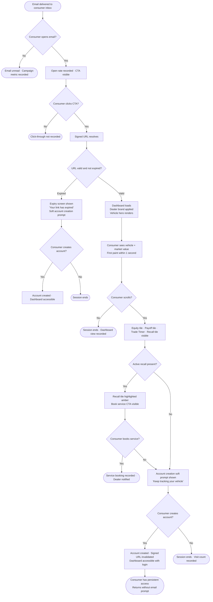
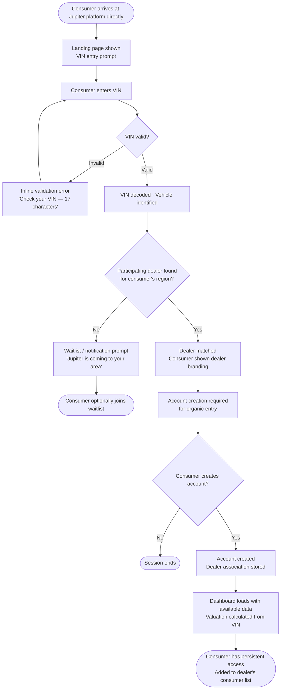
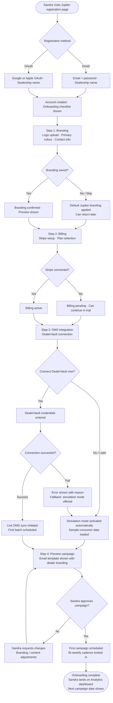
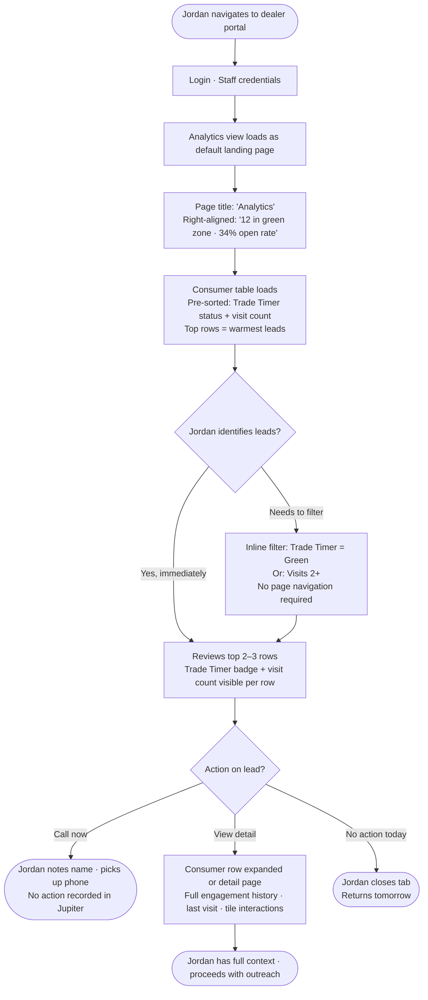
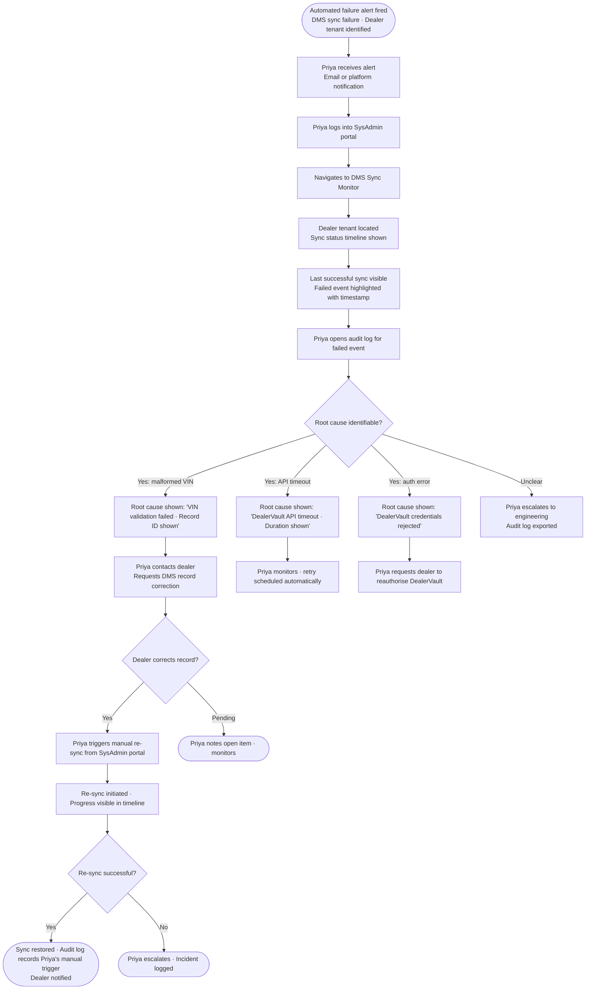

# UX Design Specification Rider

**Author:** Aayush Makhija
**Date:** 2026-03-23

---

## Executive Summary

### Project Vision

Jupiter is relationship infrastructure for automotive dealerships — a platform that manufactures the moment of consumer intent before they go looking elsewhere. By delivering personalized, dealer-branded vehicle insights (market value, equity, loan payoff, trade readiness, recall status) through automated bi-weekly emails linked to a secure consumer dashboard, Jupiter keeps dealers present in consumers' lives with zero manual effort. The core UX principle: every design decision must make the consumer feel informed by their trusted dealer, not marketed to by a SaaS platform.

### Target Users

**Consumer** — A busy vehicle owner who receives a dealer-branded email, almost deletes it, but clicks through when a number catches their eye. They arrive at their dashboard with no intent and no account. The UX has one job in those first seconds: make the data feel personal, credible, and worth returning to.

**Dealer Admin** — A dealer principal who has been burned by tools that require constant manual effort and deliver no measurable results. Their UX goal: complete onboarding in under 30 minutes, approve the first campaign, and then never have to think about Jupiter again — while warm leads arrive.

**Dealer Staff** — A sales associate who doesn't own the product, just uses the analytics. Their UX goal: open a screen every morning and immediately know which customers are ready to have a conversation.

**Jupiter SysAdmin** — An operations/compliance lead who needs audit-level confidence. Their UX goal: when something breaks, find the trail fast. When everything is running, prove it clearly.

### Key Design Challenges

1. **Zero-friction first impression on mobile** — The consumer dashboard must communicate value within 3 seconds with no login, on a phone. Generic feels like spam; personal feels like a service.
2. **Financial complexity → emotional clarity** — Vehicle equity, payoff curves, and trade readiness are intimidating. The UX must translate numbers into feelings (positive equity = green confidence, Trade Timer = readable urgency) without sacrificing accuracy.
3. **Multi-brand trust** — Jupiter must disappear. Each consumer must feel they are interacting with their dealer's platform, not a white-labeled SaaS product.
4. **Onboarding that doesn't feel like an IT project** — DMS integration, brand configuration, and billing must be sequenced to feel like setting up a social profile, not configuring enterprise software.

### Design Opportunities

1. **Trade Timer as a hero moment** — Jupiter's most differentiating signal deserves visceral visualization. A readiness countdown or status arc ("You enter your optimal trade window in 47 days") is emotionally compelling in a way a plain data point never will be.
2. **Analytics that create daily habits** — The dealer staff view can be the difference between a tool that gets checked daily and one that collects dust. Visual urgency indicators for high-intent consumers ("3 customers in the green zone") create motivation, not just information.
3. **The signed URL → account conversion funnel** — The moment a URL expires is Jupiter's best acquisition opportunity. The upgrade prompt must feel like a gift ("Keep tracking your vehicle") not a paywall.

## Core User Experience

### Defining Experience

Jupiter's UX lives or dies on two distinct moments of truth:

**Moment 1 — The Consumer Cold Entry.**
A consumer arrives from a dealer-branded email — but the dealer controls the copy, so the quality of the warm-up is unpredictable. The dashboard cannot rely on the email having set expectations. It must be entirely self-evident on arrival: whose car, whose numbers, why it matters — within 3 seconds, on a phone, with no account. This is the make-or-break interaction. Every downstream behavior (repeat visits, account creation, trade inquiry) depends on winning this moment.

**Moment 2 — The Dealer Staff Morning Scan.**
Jordan opens the analytics dashboard at the start of each day and needs to know — in under 30 seconds — which customers are worth a call. This is a daily workflow tool, not a reporting view. It must reward the habit of opening it by immediately surfacing signal over noise.

### Platform Strategy

**Consumer Dashboard:** Mobile-first, touch-optimized. Accessed primarily via email link on a smartphone. No assumptions about account state or session continuity on first visit. Progressive disclosure — the most important data leads; complexity is available but not forced.

**Dealer Admin & Staff Portal:** Desktop-primary, designed for focused seated work (onboarding, analytics review, campaign management). Fully responsive for mobile access, but the primary experience is optimized for a wide-screen context where data density and multi-column layouts are appropriate. Touch interactions should work, but are not the design driver.

### Effortless Interactions

The following must feel completely frictionless — zero cognitive load, zero hesitation:

- **Consumer: arriving at the dashboard** — Vehicle identity (year, make, model, image) and current market value are immediately visible above the fold with no scroll. No login prompt on first entry.
- **Consumer: understanding equity** — Positive or negative equity must be communicated through color and plain language before a number is read. Green = good. Red = not yet.
- **Consumer: converting to an account** — When the signed URL expires, the upgrade prompt must feel like a natural continuation ("Keep tracking [Vehicle]") not a forced registration wall.
- **Dealer Staff: identifying hot leads** — Filtering to trade-ready, high-engagement consumers must be a single interaction, not a multi-step report configuration.
- **Dealer Admin: activating the first campaign** — After branding and DMS setup, the path to "first campaign scheduled" should feel like pressing a single confident button, not approving a complex configuration.

### Critical Success Moments

| User | Make-or-Break Moment | What Success Looks Like |
|---|---|---|
| Consumer | First dashboard view (cold entry) | Immediately sees their vehicle and a number that feels personal and credible |
| Consumer | Signed URL expiry | Chooses to create an account rather than abandoning |
| Dealer Admin | Completing onboarding | Activates first campaign with confidence in under 30 minutes |
| Dealer Staff | Morning analytics scan | Identifies 1–3 actionable leads without needing to configure filters |
| Jupiter SysAdmin | Diagnosing a DMS failure | Finds root cause in audit log within 2 minutes |

### Experience Principles

1. **Data before identity** — The consumer sees their vehicle data before they are ever asked for an account. Trust is earned before it is requested.
2. **Vehicle Value anchors everything** — Current market value is the first number a consumer reads. All other tiles (equity, payoff, trade readiness) are framed relative to it. Clarity of value creates the foundation for every other insight.
3. **Signal over noise for dealers** — The dealer-side UX surfaces actionable signals (hot leads, campaign performance, sync health) prominently. Detailed data is available, but never leads.
4. **The dealer brand is the only brand consumers see** — Jupiter's identity is invisible to consumers. Every consumer-facing surface reflects dealer branding: logo, colors, tone. Jupiter operates as infrastructure, not a product.
5. **Effortless first, configurable second** — Every user's first interaction with any part of the platform must work without configuration, training, or documentation. Power features exist, but never block the primary path.

## Desired Emotional Response

### Primary Emotional Goals

**Consumer — Positive Surprise.**
The consumer should feel like they've just discovered something genuinely useful that they didn't know existed. Not "I was sold to." Not "my dealer wants something from me." The feeling is closer to: *"I didn't realise I could know this about my own car."* This is the emotion of a pleasant, unprompted discovery — the same feeling as checking your credit score for the first time and finding it's better than expected. Surprise that becomes trust. Delight that becomes a habit.

**Dealer Admin — Quiet Control.**
After a history of tools that demanded constant attention, the Dealer Admin should feel the quiet satisfaction of a machine that runs itself. Not excitement — relief. The feeling of setting something up properly and watching it work. The dashboard shouldn't make them feel busy; it should make them feel smart for choosing it.

**Dealer Staff — Unfair Advantage.**
Jordan should feel like he knows something his competitors don't. The morning scan should feel like having insider information — a shortlist of customers who are ready to trade before they know it themselves. Confidence, sharpness, momentum.

**Jupiter SysAdmin — Calm Confidence.**
When everything runs, Priya should feel nothing — invisible infrastructure is the goal. When something breaks, she should feel in control, not alarmed. The audit trail exists so that problems have clear answers, not mysteries. The emotional target is: "I found it, I fixed it, I proved it."

### Emotional Journey Mapping

| Stage | Consumer | Dealer Admin | Dealer Staff |
|---|---|---|---|
| First arrival | Mild curiosity → Genuine surprise ("this is my actual car value") | Mild skepticism → Growing confidence as setup progresses | Neutral → Quickly oriented |
| Core interaction | Engaged discovery — scrolling to see more | Calm satisfaction — watching the campaign activate | Focused clarity — seeing the shortlist |
| Task completion | "I want to come back to this" | "This will run itself" | "I know who to call" |
| Error / failure | Calm reassurance — no alarm, no confusion | Transparent status — knows what's happening | Unaffected if unrelated to their view |
| Return visit | Familiarity + anticipation ("what's changed?") | Passive confidence | Daily ritual — habitual check |

### Micro-Emotions

**Consumer:**
- **Trust over skepticism** — Vehicle Value shown with data attribution (JD Power, Black Book) makes the number feel sourced, not invented. Attribution isn't a footnote — it's a trust signal.
- **Surprise over expectation** — The Trade Timer, equity position, and recall status should feel like discoveries, not confirmations. Layout and copy should frame each tile as a reveal, not a report.
- **Ownership over overwhelm** — The consumer should feel like the data belongs to them. Not a dealer pitch, not a finance lecture. Their car, their numbers, their choice.

**Dealer Admin:**
- **Confidence over anxiety** during onboarding — Progress indicators, simulation mode, and a clear "you're ready to launch" moment eliminate fear of misconfiguration.
- **Pride over indifference** at analytics — Seeing a 34% open rate should feel like a win they can attribute to their brand, not just a number on a screen.

**Dealer Staff:**
- **Urgency without pressure** — The lead shortlist creates motivation to act, but should never feel like surveillance or a quota system.

**Jupiter SysAdmin:**
- **Clarity over complexity** — Audit logs and sync dashboards should feel like reading a timeline, not decoding a system log.

### Design Implications

| Emotional Goal | UX Design Approach |
|---|---|
| Consumer positive surprise | Progressive tile reveal on scroll; copy framed as insight ("Your equity has grown") not data label ("Equity: $4,200"); first-time dashboard animation that draws the eye to Vehicle Value |
| Consumer trust | Data source attribution on valuation tiles; dealer logo and brand color prominent at the top; no Jupiter branding visible to consumers |
| Calm reassurance on errors | Soft, neutral language for stale data or unavailable tiles ("We're refreshing your data — check back shortly"); tiles gracefully hidden rather than showing error states |
| Dealer Admin quiet control | Onboarding progress bar; simulation mode as a confidence-builder before going live; campaign activation as a single prominent CTA with clear confirmation |
| Dealer Staff unfair advantage | High-signal lead indicators (badge counts, color-coded trade readiness); default view shows top opportunities, not raw data tables |
| SysAdmin calm confidence | Chronological audit log with clear action labels; DMS sync health shown as a status timeline, not just a boolean; failure alerts with root cause hints, not just error codes |

### Emotional Design Principles

1. **Lead with the reveal, not the label** — Every data point on the consumer dashboard should be introduced with context ("Your vehicle is worth") before showing the number. Numbers without context are data. Numbers with context are insights.
2. **Calm is a design choice** — Error states, loading states, and stale data should never feel alarming. Soft language, neutral tones, and graceful degradation keep the consumer experience trustworthy even when data is incomplete.
3. **Let the data do the selling** — The consumer dashboard must never feel like a dealer CTA. Trade Timer and equity data speak for themselves. CTAs exist, but never dominate. The emotional journey from insight to action must feel self-directed.
4. **Reward the habit** — Dealer Staff and returning consumers should feel a subtle sense of anticipation when opening the platform. New data, updated signals, and visible changes since last visit reinforce the habit of returning.
5. **Invisible infrastructure, visible results** — For Dealer Admin, the platform should disappear into the background. What remains visible are outcomes: leads, open rates, consumer activity. The work is done; the results are clear.

## UX Pattern Analysis & Inspiration

### Inspiring Products Analysis

**Coin by Zerodha — Consumer Dashboard Reference**

Coin is one of India's most respected financial UX products precisely because it makes complex investment data feel approachable and personal. The patterns that make it relevant for Jupiter's consumer dashboard:

- **Color as a financial language** — Green and red are used with discipline and consistency to communicate gain vs. loss at a glance. Users don't read numbers first; they read color first. This is the exact model for Jupiter's equity and Trade Timer tiles.
- **Card-based progressive disclosure** — Each holding is a card. Summary on the surface, detail on tap. Users get the answer they need at the summary level; depth is available but never forced. This maps directly to Jupiter's tile architecture (Value → Equity → Payoff → Trade Timer → Recall).
- **Numbers as heroes** — Typography hierarchy is ruthless: the most important number is the largest thing on the screen. Supporting data is visibly smaller. Jupiter's Vehicle Value should dominate the first screen the same way a portfolio total dominates Coin's home screen.
- **Minimal chrome, maximum data** — No heavy navigation, no sidebars, no competing UI elements. The product steps out of the way and lets the financial data breathe.
- **Trust through attribution** — Data sources and timestamps are visible but unobtrusive. They don't overwhelm — they reassure. Jupiter should show "Valued by JD Power" the way Coin shows exchange data attribution.

**Supabase — Dealer Portal Reference**

Supabase has set a new standard for what developer and admin tools feel like. Clean, data-dense, but never oppressive. The patterns relevant to Jupiter's dealer portal:

- **Table-first data views** — Sortable, filterable tables are the primary content pattern. Data is always accessible, never buried. Jordan's analytics view should feel like a Supabase table — clear columns, quick filtering, immediate readability.
- **Status indicators that communicate instantly** — Green dots, colored badges, and status chips mean a user never has to read a paragraph to understand system health. DMS sync status, campaign health, and consumer engagement tiers should all use this pattern.
- **Summary cards above data tables** — Key metrics (total consumers, last campaign open rate, active leads) live in stat cards at the top of the page. The table below provides the detail. Dealers scan the cards first; they drill into the table when they need to.
- **Clean empty states with purposeful CTAs** — When there's nothing yet (no campaign sent, no consumers synced), Supabase shows a clean empty state with a clear next action. Jupiter's onboarding flow should use this pattern — every empty state is a guided next step, not a blank screen.
- **Sidebar navigation with role-aware visibility** — Navigation items appear only for the roles that have access to them. Dealer Staff simply don't see Billing or Branding — the navigation reflects their reality, reducing cognitive load.

### Transferable UX Patterns

**Navigation Patterns:**
- **Sidebar nav (dealer portal)** — Role-scoped, clean, Supabase-style. Items visible only to the roles that own them. No greyed-out items that create confusion.
- **Tab-less consumer dashboard** — Single scrollable page, no bottom tab bar. Cards stack vertically; the scroll is the navigation. Coin-style.

**Interaction Patterns:**
- **Card tap to detail expansion** — Consumer tiles are cards. Tapping a tile expands detail (e.g., tapping Vehicle Value shows the 24-month trend chart). Summary always visible; depth always accessible.
- **Single-action campaign activation** — After setup, activating a campaign is one prominent button with a confirmation state. No multi-step wizard at the moment of launch.
- **Inline filtering on analytics tables** — Jordan filters the lead table inline (Trade Timer: Green, Visits: 2+) without leaving the page or opening a modal.

**Visual Patterns:**
- **Green / red / amber for financial states** — Borrowed from Coin. Green = positive equity, trade-ready. Red = negative equity, not yet. Amber = approaching threshold.
- **Stat cards + table layout for dealer analytics** — Borrowed from Supabase. Top of page: summary numbers. Below: the full data table with filtering.
- **Tabular numerals** — Financial figures (equity, payoff, market value) use tabular number rendering so columns align and digits don't shift width on update.

### Anti-Patterns to Avoid

- **Login gate before data** — Forcing account creation before showing the consumer their vehicle data kills the positive surprise moment. Never add a login wall on first entry.
- **Dashboard overload on first view** — Showing all tiles simultaneously with equal visual weight overwhelms and dilutes. Vehicle Value must lead; secondary tiles follow in a clear hierarchy.
- **Dealer CRM aesthetics** — Legacy automotive CRM tools are notorious for dense, cluttered interfaces with poor hierarchy. Jupiter's dealer portal should feel nothing like them.
- **Error states that alarm** — Red banners, warning triangles, and "Error:" prefixes on consumer-facing content destroy trust. Graceful degradation and soft language are non-negotiable.
- **Generic charts without context** — A 24-month trend line with no annotation is data without insight. Charts should be accompanied by a single plain-language summary sentence.

### Design Inspiration Strategy

**What to Adopt directly:**
- Coin's card-based tile architecture and color-as-financial-language system for the consumer dashboard
- Supabase's stat card + sortable table layout for dealer analytics
- Supabase's role-scoped sidebar navigation for the dealer portal
- Both products' minimal chrome philosophy — UI steps aside; content leads

**What to Adapt for Jupiter:**
- Coin's portfolio card pattern → adapted into Jupiter's vehicle insight tiles (same progressive disclosure, but the asset is a single vehicle, not a portfolio)
- Supabase's empty state + CTA pattern → adapted into Jupiter's onboarding steps (each incomplete setup stage shows a purposeful next action, not a blank screen)
- Supabase's status badge system → adapted for consumer engagement tiers in the lead table (Trade Timer: green badge, Visit count: numeric badge)

**What to Reject entirely:**
- Supabase's dark-mode-first aesthetic for the consumer dashboard — Jupiter's consumer experience should be light, warm, and dealer-branded. Dark mode suits the dealer portal but not the consumer's vehicle insight view.
- Any pattern that gates value behind account creation. The signed URL flow exists precisely to skip this friction.

## Design System Foundation

### Design System Choice

**shadcn/ui + Tailwind CSS**, built on Next.js + React.

Two distinct visual surfaces, one unified system:
- **Consumer Dashboard** — Light, warm, dealer-branded. Tailwind CSS variables drive per-tenant color theming (dealer primary color, logo placement). shadcn/ui components provide the accessible, minimal base; Tailwind utilities handle the financial card aesthetics inspired by Coin.
- **Dealer Portal** — Clean, data-dense, fixed aesthetic. Supabase-inspired sidebar layout, stat cards, and sortable tables built on shadcn/ui's Table, Card, and Badge components. No per-tenant theming required — consistent professional look across all dealer accounts.

### Rationale for Selection

- **Stack alignment** — Next.js + React + Tailwind is the confirmed frontend stack. shadcn/ui is purpose-built for this combination; zero friction in adoption.
- **Dealer branding flexibility** — Tailwind CSS custom properties (design tokens) make per-tenant color theming straightforward. Dealer primary color, accent, and logo propagate through CSS variables — no component-level overrides required.
- **Component ownership** — shadcn/ui components are copied into the codebase, not imported from a black-box library. Full control over behaviour, styling, and accessibility — critical for a platform that must render correctly across dealer-branded contexts.
- **Coin-style consumer UX** — Tailwind's utility-first approach makes it easy to build the typography-heavy, card-based financial dashboard aesthetic without fighting a pre-opinionated design system.
- **Supabase-style dealer portal** — shadcn/ui's DataTable, Badge, and Card primitives are the exact components that produce the clean admin aesthetic we're targeting.
- **WCAG 2.1 AA compliance** — shadcn/ui components ship with accessible defaults (aria labels, keyboard navigation, focus rings). Accessibility is built in, not retrofitted.

### Implementation Approach

**Consumer Dashboard (mobile-first, dealer-branded):**
- Tailwind CSS variables for dealer theme tokens: `--dealer-primary`, `--dealer-accent`, `--dealer-logo-url`. Set at the layout level from dealer config on each signed URL resolve.
- shadcn/ui Card as the base for every vehicle insight tile. Each tile is a self-contained card with summary-visible and detail-expanded states.
- Tailwind typography scale: Vehicle Value rendered at `text-4xl font-bold`; supporting data at `text-sm text-muted-foreground`. Numbers lead; labels follow.
- Green / red / amber financial states via Tailwind semantic color tokens: `text-emerald-600` (positive equity), `text-red-500` (negative equity), `text-amber-500` (approaching threshold).
- Single-column scrollable layout on mobile; two-column card grid on tablet+.

**Dealer Portal (desktop-primary, fixed aesthetic):**
- shadcn/ui Sidebar for role-scoped navigation. Navigation items rendered conditionally based on user role — Staff sees no Billing or Branding routes.
- shadcn/ui DataTable with TanStack Table for the consumer engagement analytics view. Inline column filtering, sortable headers, row-level status badges.
- shadcn/ui Card for summary stat blocks at the top of analytics pages (total consumers, last campaign open rate, active leads in green zone).
- shadcn/ui Badge for status indicators: DMS sync health, Trade Timer tier, consumer engagement level.
- Light mode default; dark mode optional for dealer portal (Tailwind `dark:` variants available if needed post-MVP).

### Customization Strategy

**Design Tokens (Tailwind theme extension):**
- `dealer`: { primary, accent, foreground } — per-tenant, set via CSS vars
- `equity`: { positive, negative, neutral } — financial state palette
- `status`: { green, amber, red, grey } — system status palette
- `surface`: { card, page, sidebar } — layout surfaces

**Component Extension Pattern:**
- Base shadcn/ui components used as-is for standard interactions (Button, Input, Dialog, Badge, Table)
- Extended variants created for Jupiter-specific components: `VehicleInsightCard`, `TradeTimerGauge`, `LeadScoreRow`, `SyncStatusTimeline`
- Consumer-facing components always accept a `dealerTheme` prop that applies CSS variable overrides at the component root

**Typography:**
- Inter (or Geist) as the primary typeface — clean, legible at all sizes, excellent tabular numeral support for financial data
- Tabular nums enabled via `font-variant-numeric: tabular-nums` on all financial figures to prevent layout shift as values update

## Defining Core Experience

### Defining Experience

Jupiter has two co-equal defining experiences — one for each side of the platform. Neither works without the other, and both must be executed with the same level of craft.

**Consumer: "I didn't know I could know this."**
> Open an email from your dealer, tap once, and instantly see what your car is worth — no account, no login, no sales pitch.

The consumer arrives cold. The dashboard has one job: make them feel like they just discovered something genuinely useful about their own vehicle, without ever feeling like they were sold to. If this moment lands, everything else follows — the return visit, the account creation, the trade inquiry. If it doesn't, nothing downstream matters.

**Dealer Staff: "I know who to call before my competition does."**
> Open the analytics dashboard first thing in the morning and immediately see which customers are approaching their trade window — no configuration, no report setup, no digging.

Jordan arrives with a purpose: identify the warm leads and move. The analytics view has one job: surface the shortlist before he has to ask for it. If the right names are visible within 30 seconds of opening, Jupiter becomes a daily habit. If it requires effort to find the signal, it becomes a tool that gets checked once a month.

### User Mental Model

**Consumer Mental Model:**
Consumers have no existing mental model for a dealer-branded vehicle insight dashboard — this is a new category. What they do bring is a mental model from financial apps:
- "Numbers in green mean good. Red means bad."
- "My portfolio value is the first thing I see."
- "I can tap a card to see more detail."
- "Data this personal should be trustworthy — I want to know where it comes from."

The UX must meet these borrowed expectations exactly. Fighting the financial app mental model would require user education Jupiter cannot afford. Working with it makes the dashboard instantly legible to anyone who has ever opened a banking or investment app.

**Dealer Staff Mental Model:**
Jordan's mental model comes from CRM and sales tools — but his frustration with those tools is well-documented. He expects:
- "The important stuff is buried and I have to configure it."
- "I'll need to run a report or apply filters to find hot leads."
- "This will take longer than I want it to."

Jupiter's opportunity is to shatter this expectation. The default view should already show him what he needs. No filter setup. No report wizard. The shortlist is the default state, not the result of effort.

### Success Criteria

**Consumer dashboard cold-entry is successful when:**
- Vehicle is identified (year, make, model) above the fold within 1 second of load
- Current market value is the dominant visual element — largest number on screen
- Consumer does not need to scroll to understand that the data is about their car
- No login prompt appears before any data is shown
- Consumer scrolls down voluntarily (curiosity, not instruction)
- Consumer returns to the URL within 7 days without a second email prompt

**Dealer staff morning scan is successful when:**
- Page load to "I know who to call" takes under 30 seconds
- High-intent consumers are visible in the default view without filter configuration
- Trade Timer status and recent visit count are visible at the row level — no click required
- Jordan can identify 1–3 names worth calling before his first coffee is finished
- He opens it again tomorrow without being asked

### Novel vs. Established Patterns

**Consumer Dashboard — Familiar patterns, novel context:**
The consumer dashboard uses entirely familiar UX patterns (financial card layout, color-coded status, progressive disclosure). The novelty is not the interaction design — it's the content. Consumers have never received this data from their dealer before. The UX deliberately uses established patterns to make novel content feel immediately trustworthy and legible. No user education required.

The one genuinely novel element is the **Trade Timer** — a readiness signal with no direct analogue in consumer finance apps. The UX approach: frame it as a countdown-style indicator (familiar from countdowns, progress bars, and timers in other contexts) rather than an abstract score. "You enter your optimal trade window in 47 days" is concrete and readable. "Trade Readiness: 73%" is not.

**Dealer Staff Analytics — Familiar patterns, raised expectations:**
The analytics view uses established data table and dashboard patterns (Supabase, Linear, Notion databases). The innovation is in the defaults — pre-sorted by engagement signal, pre-filtered to active consumers, Trade Timer status visible at the row level without drilling in. The pattern is familiar; the effort saved is the differentiator.

### Experience Mechanics

**Consumer Cold-Entry Flow:**

1. **Initiation** — Consumer taps email CTA. Signed URL resolves. No redirect, no splash screen, no loading skeleton that looks broken. Dealer logo and brand color appear within the first paint.

2. **Interaction** — Single scrollable page. Vehicle hero section (image, year, make, model) loads first. Vehicle Value tile renders immediately below with the current market value as the dominant number. Supporting tiles (Equity, Payoff, Trade Timer, Recall) stack below in priority order. Each tile is a card — tappable for detail, readable at summary level.

3. **Feedback** — Color communicates state before numbers are read. Equity tile: green border + positive number = immediately understood. Trade Timer: progress arc or countdown text = instantly scannable. Recall tile: amber badge if active recall exists = draws attention without alarming.

4. **Completion** — No explicit completion state. The consumer has learned what their car is worth. The next step surfaces naturally: "Want to keep tracking this?" (account creation CTA) appears as a soft prompt after they've scrolled past the core tiles — earned, not forced.

**Dealer Staff Morning Scan Flow:**

1. **Initiation** — Jordan opens the dealer portal and navigates to the Analytics view (or it is the default landing page post-login). No configuration required.

2. **Interaction** — Default view: stat cards at top (total active consumers, last campaign open rate, consumers in green Trade Timer zone). Below: consumer table pre-sorted by engagement score (Trade Timer status + recent visits). Top rows are the warmest leads. Jordan reads down the list.

3. **Feedback** — Each row shows: consumer name, vehicle, Trade Timer badge (Green / Amber / Red), dashboard visits in last 30 days, last visit date. A green Trade Timer badge + 2+ recent visits = call this person today. No calculation required — the signal is composed at the row level.

4. **Completion** — Jordan identifies his shortlist, flags or notes the names (or picks up the phone directly). The scan is complete. The interaction took under 30 seconds. He will do it again tomorrow.

## Visual Design Foundation

### Color System

Jupiter's brand palette of blue, green, and white maps directly onto the two surfaces and the financial state language established in our emotional design principles.

**Jupiter Brand Palette (Dealer Portal):**

| Token | Value | Usage |
|---|---|---|
| `--jupiter-blue` | `#2563EB` (blue-600) | Primary actions, navigation active state, links |
| `--jupiter-blue-light` | `#EFF6FF` (blue-50) | Sidebar background, stat card backgrounds |
| `--jupiter-blue-dark` | `#1E40AF` (blue-800) | Hover states, pressed states |
| `--jupiter-green` | `#059669` (emerald-600) | Success states, active badges, positive indicators |
| `--jupiter-green-light` | `#ECFDF5` (emerald-50) | Success tile backgrounds, green zone highlights |
| `--surface-white` | `#FFFFFF` | Page background, card surfaces |
| `--surface-muted` | `#F8FAFC` (slate-50) | Table row alternates, input backgrounds |
| `--border` | `#E2E8F0` (slate-200) | Card borders, table dividers, input outlines |
| `--text-primary` | `#0F172A` (slate-900) | Body text, headings |
| `--text-muted` | `#64748B` (slate-500) | Supporting labels, metadata, timestamps |

**Financial State Palette (Consumer Dashboard + Dealer Analytics):**

| State | Color | Token | Usage |
|---|---|---|---|
| Positive equity / Trade-ready | `#059669` | `equity-positive` | Green tile border, positive equity value, Trade Timer green badge |
| Negative equity / Not yet | `#EF4444` | `equity-negative` | Red tile border, negative equity value |
| Approaching threshold | `#F59E0B` | `equity-approaching` | Amber badge, Trade Timer amber zone |
| Neutral / No data | `#94A3B8` | `equity-neutral` | Greyed tile, data pending state |

The financial state palette is fixed across all tenants — these colors are universal financial conventions that consumers read instinctively. They are never overridden by dealer theming.

**Per-Tenant Dealer Theming (Consumer Dashboard):**

| Token | Source | Usage |
|---|---|---|
| `--dealer-primary` | Dealer config | Hero section background, CTA button color, link color |
| `--dealer-accent` | Dealer config | Secondary interactive elements, highlight borders |
| `--dealer-foreground` | Auto-derived | Text on dealer primary (white or dark, calculated for contrast) |
| `--dealer-logo` | Dealer config | Logo URL, rendered in header of consumer dashboard |

Jupiter's blue is used as the default `--dealer-primary` for any dealer that has not configured custom branding — ensuring the consumer dashboard always renders correctly even before branding setup is complete.

### Typography System

**Primary Typeface: Inter** (with Geist as fallback for Next.js projects)

Inter is the de facto standard for clean, legible SaaS and financial interfaces. Its tabular numeral support is essential for Jupiter's financial figures — digits maintain consistent width as values update, preventing layout shift.

**Type Scale:**

| Level | Size / Weight | Usage |
|---|---|---|
| Display | `text-4xl font-bold` (36px) | Vehicle Value on consumer dashboard — the hero number |
| H1 | `text-2xl font-semibold` (24px) | Page titles, section headers |
| H2 | `text-xl font-semibold` (20px) | Card titles, tile headers |
| H3 | `text-base font-semibold` (16px) | Sub-section labels, stat card values |
| Body | `text-sm` (14px) | Supporting text, table cell content |
| Caption | `text-xs text-muted-foreground` (12px) | Data attribution ("Valued by JD Power"), timestamps, footnotes |

**Tabular Numerals:**
All financial figures (Vehicle Value, Equity, Payoff, loan amounts) apply `font-variant-numeric: tabular-nums` to ensure column alignment and prevent visual jitter as cached values refresh.

**Tone:**
The typography system is intentionally neutral and legible — the data is the personality, not the font. Inter's clean geometry supports both the "trusted financial tool" consumer feel and the "professional admin portal" dealer feel without needing a secondary display face.

### Spacing & Layout Foundation

**Base Unit: 4px** (Tailwind's default spacing scale)

A 4px base unit provides enough granularity for tight data-dense layouts (dealer tables) and spacious card layouts (consumer dashboard) from the same system.

**Consumer Dashboard Layout:**
- Single-column on mobile (`max-w-screen-sm`, padded `px-4`)
- Two-column card grid on tablet+ (`grid-cols-2 gap-4`)
- Card internal padding: `p-4` (16px) on mobile, `p-6` (24px) on tablet+
- Tile spacing: `space-y-4` (16px gap between stacked cards)
- Generous whitespace — cards breathe; nothing feels cramped
- Vehicle hero section: full-width, `pb-6` separation from first tile

**Dealer Portal Layout:**
- Fixed sidebar: `w-64` (256px), full viewport height
- Main content area: fluid, `px-6 py-6` internal padding
- Stat cards row: `grid-cols-4 gap-4` on desktop, `grid-cols-2` on tablet
- Table: full width, `text-sm`, row height `h-12` (48px) for comfortable scanning
- Data density calibrated to desktop — efficient but not cramped

**Elevation & Depth:**
- Cards: `shadow-sm` — subtle, not dramatic
- Modals / Dialogs: `shadow-lg` — clearly floating
- Sidebar: `border-r border-slate-200` — division without shadow
- No heavy drop shadows — the aesthetic is flat with gentle structure

### Accessibility Considerations

- **Contrast** — All text/background combinations target WCAG 2.1 AA (4.5:1 for body, 3:1 for large text). Jupiter blue on white: 4.6:1 ✓. Emerald-600 on white: 4.5:1 ✓.
- **Color alone is never the only signal** — Financial states (green/red/amber) are always paired with a text label or icon. A colorblind consumer can still read "Positive equity" without relying on green alone.
- **Focus rings** — shadcn/ui's default focus rings retained and visible on all interactive elements. Never removed for aesthetic reasons.
- **Font size floor** — `text-xs` (12px) is the minimum used for any content a user needs to act on. Attribution captions at 12px are informational only.
- **Touch targets** — All tappable elements on the consumer dashboard meet the 44×44px minimum touch target size on mobile.

## Design Direction Decision

### Design Directions Explored

Six directions were explored across both consumer dashboard and dealer portal surfaces:

- **A — Financial Trust**: Coin-inspired cards, dark sidebar portal
- **B — Bold Hero**: Full-width vehicle image hero with value overlay
- **C — Minimal Data**: Ultra-sparse, whitespace-heavy, typography-first
- **D — Warm Welcome**: Friendly copy, soft gradients, conversational tone
- **E — Command Center**: Dense dark metrics bar, power-user analytics table
- **F — Sales Ready**: Explicit priority tiers (Call today / this week / monitor)

### Chosen Direction

**Consumer Dashboard: Bold Hero + Minimal Data (B + C)**

The consumer experience opens with Direction B's full-width vehicle hero — dealer logo, vehicle image or illustration, and the market value as a large overlay on a dark gradient. This is the "positive surprise" moment: dramatic, personal, immediate. Below the hero fold, the tile layout adopts Direction C's minimal, typographic approach — generous whitespace, numbers leading, labels restrained. The drama is concentrated at the top; the data breathes below.

**Dealer Portal: Minimal Data + Inline Page Stats (C + adapted E)**

The dealer portal adopts Direction C's clean, typographic restraint throughout — white sidebar, no heavy cards, borders and typography as the primary design tools. The Command Center's need for at-a-glance metrics is addressed without stat boxes: the two most important numbers (green zone count + campaign open rate) appear right-aligned in the page title row, on the same line as the page heading. No added layout height, no visual ceremony.

```
Analytics                    12 in green zone  ·  34% open rate
```

The remaining metrics (total active consumers, Jupiter-attributed leads) are available in the table itself or as column summaries — present when needed, never dominating the layout.

### Design Rationale

**Consumer (B + C):**
- The Bold Hero concentrates the "positive surprise" emotional impact at the single most important moment — the first 3 seconds of cold entry. The vehicle visual and value overlay make the dashboard feel personal and credible before any scrolling.
- Minimal Data below the hero ensures the financial tiles don't compete with each other. Each number has room to be read. The sparse layout reinforces credibility — it feels like a trusted source, not a marketing page.
- The contrast between the dramatic hero and the calm data below creates a natural visual rhythm: arrive with impact, explore with ease.

**Dealer Portal (C + inline stats):**
- Direction C's clean aesthetic aligns with the "quiet control" emotional target — the portal feels professional and uncluttered, never overwhelming.
- Four stat boxes in a grid create layout weight disproportionate to the information they carry. Two numbers right-aligned in the title row delivers the same morning scan value with zero added vertical space.
- The table starts immediately — Jordan's eyes go directly to the leads.

### Implementation Notes

**Consumer dashboard composition:**
- Hero: full-width dark gradient, dealer logo top-left, vehicle year/make/model and `$VALUE` as dominant overlay text. Value at `text-4xl font-bold`.
- Below the fold: Direction C typographic layout — section dividers, left-right paired values, progress bar for Trade Timer, inline recall alert.
- Account creation CTA: minimal text link at page bottom, never a modal or interrupt.

**Dealer portal composition:**
- Sidebar: white background, typographic nav, role-scoped visibility.
- Page header: title left-aligned, 2 key metrics right-aligned in `text-sm text-muted-foreground`. Separated by a `·` divider. Updates on data refresh.
- Table: full-width, pre-sorted by engagement signal (Trade Timer + visit count), TanStack Table via shadcn/ui DataTable. Begins immediately below the title row.
- No stat card grid. No dark metrics bar. Borders and color alone create structure.

## User Journey Flows

### Journey 1: Consumer — Email-Triggered Cold Entry

Marcus receives a dealer-branded bi-weekly email, taps through, and experiences Jupiter for the first time — no account, no context, no intent.



**Flow optimisations:**
- Dashboard hero renders on first paint — no skeleton loader that looks broken
- No login prompt before any data is shown
- Account CTA appears only after consumer has scrolled past core tiles — earned, not forced
- URL expiry screen is the upgrade funnel, not an error state

---

### Journey 2: Consumer — Direct / Organic Entry

Marcus discovers Jupiter directly and arrives without a dealer-issued signed URL.



**Flow optimisations:**
- VIN entry is the only required field — no form overhead
- Dealer matching is automatic and invisible to the consumer
- Organic entry requires account creation — framed as "set up your vehicle tracker", not "register"

---

### Journey 3: Dealer Admin — Onboarding to First Campaign

Sandra registers, configures her dealership, connects DMS, and activates her first campaign — target: under 30 minutes total.



**Flow optimisations:**
- Each onboarding step is independent — Sandra can skip and return
- Simulation mode activates automatically if DMS is not connected — no dead ends
- Campaign preview is the final confidence-builder before activation
- "First campaign scheduled" is the completion state, not "onboarding complete"

---

### Journey 4: Dealer Staff — Morning Scan

Jordan opens the dealer portal at the start of his day to identify which consumers are worth calling. Target: shortlist visible within 30 seconds.



**Flow optimisations:**
- Analytics is the default post-login view — zero navigation required
- Table is pre-sorted by engagement signal — no filter configuration needed for the standard morning scan
- Inline filtering available for edge cases without leaving the page
- No "save" or "submit" action — scan is passive, action happens off-platform

---

### Journey 5: Jupiter SysAdmin — DMS Failure Diagnosis

Priya receives an automated failure alert and needs to identify root cause, escalate to the dealer, and restore sync — target: root cause found within 2 minutes.



**Flow optimisations:**
- Sync status timeline is the entry point — not a raw log list
- Root cause surfaced at the event level — not buried in log lines
- Manual re-sync is a single action available directly from the dealer tenant view
- Every Priya-initiated action is captured in the audit log automatically

---

### Journey Patterns

**Entry patterns:**
- Consumer always enters via URL (signed or account login) — no app store, no download
- Dealer portal always requires authenticated login — no signed URL access
- SysAdmin portal always requires authenticated login with separate role verification

**Decision patterns:**
- Every optional step (account creation, DMS connection, billing) has a graceful skip path — no dead ends
- Error states always offer a next action — never a dead end screen
- Confirmation steps before irreversible actions (campaign activation, manual re-sync)

**Feedback patterns:**
- Progress is communicated through state changes (badge colour, status label, timeline event) not toast notifications alone
- Success states are calm and understated — no confetti or celebration animations
- Failure states use soft language and always include a next step

### Flow Optimisation Principles

1. **Default state is the useful state** — Every view loads in its most actionable configuration. Jordan's table is pre-sorted. Priya's sync monitor shows the most recent event first. Sandra's onboarding shows the next incomplete step. No configuration required to reach value.
2. **Skip paths everywhere** — Every optional step has a "do this later" path. No flow forces completion of a step that isn't immediately necessary.
3. **Errors are events, not failures** — DMS failures, expired URLs, and invalid VINs are handled as known states with clear next actions. No user should ever see a generic error screen.
4. **Off-ramps, not dead ends** — Every terminal state (URL expired, no dealer found, sync failure) offers a meaningful next step rather than ending the session abruptly.

## Component Strategy

### Design System Components

The following shadcn/ui components are used as-is with no custom extension.

| Component | Usage |
|---|---|
| `Button` | All CTAs — campaign activation, service booking, account creation, form submission |
| `Input` / `Form` | Registration, branding setup, VIN entry, DMS credentials |
| `Dialog` / `Sheet` | Confirmation dialogs (campaign activation, re-sync trigger), mobile filter drawers |
| `Badge` | Trade Timer status (Green / Amber / Red), DMS sync health, role labels |
| `Separator` | Section dividers on consumer dashboard tiles |
| `Avatar` | Consumer initials in analytics table rows |
| `DataTable` (TanStack) | Dealer analytics consumer table — sortable, filterable, pre-sorted |
| `Sidebar` | Dealer portal navigation — role-scoped, white background |
| `Sonner` (Toast) | Non-critical system notifications (sync complete, campaign scheduled) |
| `DropdownMenu` | Table row actions, user account menu |
| `Skeleton` | Loading states for dashboard tiles and table rows |

### Custom Components

#### `VehicleHeroSection`

**Purpose:** The defining first-impression moment of the consumer dashboard. Renders the dealer brand, vehicle identity, and market value as the dominant visual above the fold.

**Anatomy:**
- Full-width container with dark gradient background (`bg-gradient-to-b from-slate-900 to-slate-800`)
- Top-left: dealer logo (from `--dealer-logo`) + dealership name
- Centre/bottom: vehicle year, make, model in `text-sm text-white/70`
- Market value in `text-4xl font-bold text-white font-tabular`
- Value delta badge: `↑ $1,200 this month` in emerald or red depending on direction
- Attribution caption: `Valued by JD Power` in `text-xs text-white/50`

**States:** `loading`, `default`, `no-image`, `stale-data`

**Props:** `dealerLogo`, `dealerName`, `vehicleYear`, `vehicleMake`, `vehicleModel`, `marketValue`, `valueDelta`, `valuationSource`, `isLoading`, `isStale`

**Accessibility:** `role="banner"`, vehicle identity as `aria-label`, value as `aria-live="polite"` for data refresh updates

---

#### `VehicleInsightTile`

**Purpose:** Reusable tile for each data insight below the hero (Equity, Payoff, Trade Timer, Recall, Insurance, Warranty). Supports expandable detail state.

**Anatomy:**
- Container: full-width, `border-b border-slate-100`, `py-5 px-0` — no card box, pure typographic layout
- Label: `text-xs text-slate-400 uppercase tracking-wide`
- Primary value: `text-2xl font-bold font-tabular` with colour variant
- Supporting text: `text-xs text-slate-400 mt-0.5`
- Expand affordance: chevron right, rotates to down when expanded
- Expanded state: 24-month trend chart (Recharts) + plain-language summary

**States:** `default`, `expanded`, `positive`, `negative`, `neutral`, `loading`, `unavailable`

**Variants:** `equity`, `payoff`, `tradeTimer`, `recall`, `insurance`, `warranty`

**Accessibility:** `role="region"`, `aria-label` per tile type, expand button with `aria-expanded`

---

#### `TradeTimerIndicator`

**Purpose:** Communicates trade readiness as plain language with colour — no gauge, no arc, no percentage score.

**Anatomy:**
- Status line: coloured dot + primary text
  - Green: `● Optimal window in 47 days`
  - Amber: `● Approaching optimal window in 68 days`
  - Red: `● Not yet in trade window · Est. 94 days`
- Supporting text: `text-xs text-slate-400` — "Based on depreciation, payoff, and market seasonality"

**States:** `green`, `amber`, `red`, `loading`

**Rationale:** Text-only treatment aligns with the Minimal Data direction. The colour dot provides immediate state recognition; the plain English sentence provides the insight without requiring users to interpret a visual metaphor.

**Accessibility:** Status communicated via `aria-label` on the container — screen readers read the full sentence, not the colour

---

#### `RecallAlertTile`

**Purpose:** Surfaces active NHTSA recalls with a service booking CTA. Hidden when no recall exists.

**Anatomy:**
- Container: `bg-amber-50 border border-amber-200 rounded-xl px-4 py-3`
- Icon: amber warning symbol (left-aligned)
- Recall title: `text-sm font-semibold text-amber-800`
- Recall description: `text-xs text-amber-600`
- Book service CTA: text button `→ Book a service appointment` in `text-blue-600`

**States:** `active` (shown), `hidden` (returns null), `loading` (hidden until resolved)

**Accessibility:** `role="alert"`, `aria-label="Active vehicle recall"` on the icon

---

#### `DealerThemeProvider`

**Purpose:** Injects per-tenant dealer CSS variables at the layout level for the consumer dashboard.

**Behaviour:**
- Sets `--dealer-primary`, `--dealer-accent`, `--dealer-foreground`, `--dealer-logo` on the root element
- Falls back to Jupiter blue (`#2563EB`) if dealer has not configured branding
- `--dealer-foreground` auto-calculated for WCAG AA contrast against `--dealer-primary`
- Applied once at `ConsumerDashboardLayout` level — all child components inherit

---

#### `SyncStatusTimeline`

**Purpose:** Priya's primary diagnostic tool. Renders DMS sync events as a chronological timeline with status indicators and root cause hints.

**Anatomy:**
- Vertical event list, newest first
- Each event: timestamp + event type + status badge + expandable detail
- Status badges: `Success` (emerald), `Failed` (red), `In Progress` (blue), `Pending` (slate)
- Expanded event: root cause text, affected record IDs, duration, retry status
- Manual re-sync CTA: inline on failed events, triggers confirmation dialog before executing

**States:** `healthy`, `failed`, `in-progress`, `empty`

**Accessibility:** `role="log"`, `aria-live="polite"` for real-time updates during active sync

---

#### `OnboardingChecklist`

**Purpose:** Sandra's step-by-step onboarding progress tracker. Each step is independently completable, resumable, and skippable.

**Anatomy:**
- Vertical step list with numbered indicators
- Step states: pending (grey), active (blue, expanded), complete (emerald), skipped (slate italic)
- Active step renders content inline — no modal or page navigation
- Completion state: all steps green + "First campaign scheduled" confirmation

**Accessibility:** `role="list"`, `aria-current="step"` on the active item

---

### Component Implementation Strategy

**Ownership:** Custom components in `src/components/jupiter/`, shadcn/ui components in `src/components/ui/`. Jupiter components import from `ui/` but never pollute it.

**Theming contract:**
- Consumer-facing components consume `--dealer-primary` and `--dealer-accent` CSS variables
- Dealer portal components use fixed Jupiter tokens only — no dealer theming
- Financial state colours are fixed semantic tokens — never overridden by dealer theming

**Testing requirements:**
- `DealerThemeProvider` must be tested with edge-case dealer colours to validate contrast auto-correction
- `TradeTimerIndicator` must be screen-reader tested to confirm text-only approach is fully accessible
- `RecallAlertTile` must be tested in the hidden state to confirm no empty placeholder renders

### Implementation Roadmap

**Phase 1 — Consumer Dashboard (MVP Critical):**
- `DealerThemeProvider` — required before any consumer component renders
- `VehicleHeroSection` — highest priority, the defining first impression
- `VehicleInsightTile` — all consumer data tiles depend on this
- `TradeTimerIndicator` — rendered inside `VehicleInsightTile` variant
- `RecallAlertTile` — consumer safety signal, required for MVP

**Phase 2 — Dealer Portal (MVP Critical):**
- `OnboardingChecklist` — Sandra cannot complete onboarding without this
- `SyncStatusTimeline` — Priya cannot diagnose DMS failures without this
- shadcn/ui `DataTable` configuration — Jordan's morning scan depends on correct default sort

**Phase 3 — Enhancement (Post-MVP):**
- `VehicleInsightTile` expanded state with Recharts trend chart
- Insurance and warranty tile variants of `VehicleInsightTile`
- Advanced filtering UI on the dealer analytics DataTable

## UX Consistency Patterns

### Button Hierarchy

**Consumer Dashboard (minimal, non-intrusive):**
- **Primary action** (`Button variant="default"`) — used sparingly. Only one per screen. Reserved for account creation CTA. Full width on mobile.
- **Text action** (`Button variant="link"`) — the default for most consumer CTAs. Never a filled button for secondary actions. Example: `→ Book a service appointment`, `Keep tracking your vehicle →`
- No destructive buttons on the consumer surface.

**Dealer Portal (standard SaaS hierarchy):**
- **Primary** (`variant="default"`, Jupiter blue) — one per page section. Example: `Activate Campaign`, `Save Branding`, `Connect DealerVault`
- **Secondary** (`variant="outline"`) — supporting actions alongside a primary. Example: `Preview Email`, `Cancel`, `Skip for now`
- **Destructive** (`variant="destructive"`) — irreversible actions only, always preceded by a confirmation dialog.
- **Ghost** (`variant="ghost"`) — table row actions, icon buttons, low-stakes navigation.

**Rules:**
- Never two primary buttons in the same visual context
- Destructive actions never appear without a confirmation step
- Icon-only buttons always have a `title` and `aria-label`

---

### Feedback Patterns

**Success:** Sonner toast, bottom-right, auto-dismiss after 4 seconds. Format: plain past tense — `Campaign scheduled`, `Branding saved`. No confetti, no modal.

**Error (system / API):** Sonner toast, `variant="destructive"`, does not auto-dismiss. Plain language + next action — `Couldn't connect to DealerVault. Check your credentials and try again.` Never expose raw error codes.

**Stale / unavailable data (consumer-facing):** Inline within the affected tile only. Language: `We're refreshing your data — check back shortly`. Tile remains visible with last known value if available. Never: `Error`, `Failed`, `Unavailable`, `N/A`.

**Loading:** shadcn/ui `Skeleton` on the specific element loading — never a full-page spinner. Loading states never block interaction on already-loaded parts of the page.

**Validation (forms):** Inline, below the field. On blur, not on keystroke. Format: constructive — `Enter a valid 17-character VIN` not `Invalid VIN`. Required field errors only shown after first submit attempt.

---

### Form Patterns

- Single-column layout always — never two-column form layouts
- Label above field, always — never placeholder-as-label
- Helper text below field in `text-xs text-muted-foreground`
- Onboarding forms: progress saved automatically on field blur
- VIN entry: auto-uppercase, 17-character limit, real-time character count, inline decode confirmation once valid
- Branding colour picker: hex input + native colour picker + live preview of dealer primary applied to sample email and dashboard hero

---

### Navigation Patterns

**Consumer dashboard:** No navigation chrome. Single-page scroll. Dealer logo in the hero is not a link.

**Dealer portal:** Persistent left sidebar on desktop. Mobile: Sheet component slides in from hamburger. Role-scoped items are absent entirely, not greyed out. Page transitions: instant (Next.js routing).

**Breadcrumbs:** Used only when navigating into a detail view from a table. Format: `Analytics > Marcus Thompson`.

---

### Empty State Patterns

Every empty state has: icon, plain-language explanation, single clear next action.

| Context | Message | CTA |
|---|---|---|
| No campaigns sent yet | `Your first campaign hasn't gone out yet` | `Preview your campaign` |
| No consumers synced | `No consumers yet — connect your DMS to get started` | `Connect DealerVault` |
| No active recalls | Tile hidden entirely | — |
| No consumers in green zone | `No consumers in the green zone yet · Check back after the next campaign` | — |

**Rules:** Empty states never use the word "empty". Never show an empty table with headers and no rows — use an empty state component. Consumer tiles with no data are hidden entirely.

---

### Loading State Patterns

**Consumer dashboard cold entry:** Hero gradient renders immediately, skeleton pulse on value and vehicle name. Vehicle Value tile loads with priority. Tiles below the fold load progressively on scroll. Target: Vehicle Value visible within 1 second.

**Dealer portal table:** 5 skeleton rows render immediately. Real data replaces skeletons in-place — no layout shift. Inline filters disabled during initial load.

**DMS sync in progress:** Current event shows pulse animation. Page does not auto-refresh — manual refresh available.

---

### Modal and Confirmation Patterns

**Use a modal for:** irreversible actions (campaign activation, data deletion, manual re-sync), actions requiring additional input.

**Never use a modal for:** inline validation errors, success feedback, tile detail expansion on consumer dashboard.

**Confirmation dialog structure:**
- Title: action verb + subject — `Activate Campaign?`
- Body: one sentence explaining consequences
- Buttons: `Cancel` (outline) + primary action
- No X close button on destructive confirmations — forces explicit cancel

---

### Search and Filter Patterns

**Dealer analytics table:** Inline column filters. Filter chips appear above table when active. Single text search above table filters by consumer name or vehicle. Filters persist within the session.

**SysAdmin audit log:** Date range picker + event type filter inline above the timeline. Filters applied on change. Export as CSV button right-aligned above the timeline.

---

## Responsive Design & Accessibility

### Responsive Strategy

Jupiter operates on two distinct surfaces with different primary device contexts:

| Surface | Primary | Secondary | Approach |
|---|---|---|---|
| Consumer Dashboard | Mobile (360–430px) | Desktop | Mobile-first, progressive enhancement |
| Dealer Portal | Desktop (1280px+) | Tablet, Mobile | Desktop-first, graceful degradation |

The consumer dashboard is delivered via a signed URL in an email — the majority of consumers will open it on their phone. Every layout decision starts from 375px and expands outward.

The dealer portal is a professional tool used at a desk. Mobile support is a fallback for occasional on-lot use, not a primary use case.

---

### Breakpoint Strategy

Using Tailwind CSS default breakpoints:

| Breakpoint | Min Width | Consumer Dashboard | Dealer Portal |
|---|---|---|---|
| (default) | 0px | Single column, full bleed | — |
| `sm` | 640px | Two-column tile grid | — |
| `md` | 768px | Max-width container, centered | Mobile fallback layout |
| `lg` | 1024px | — | Primary layout, sidebar + content |
| `xl` | 1280px | — | Full dashboard, stat columns |
| `2xl` | 1536px | — | Wide table views, expanded panels |

**Consumer Dashboard Layout Progression:**
- `default`: `VehicleHeroSection` full width → single-column `VehicleInsightTile` stack → stacked CTA buttons
- `sm`: Insight tiles shift to 2-column grid
- `md`: Container max-width `480px`, centred — feels like an app, not a website

**Dealer Portal Layout Progression:**
- `lg`: Fixed left sidebar (240px) + main content area — sidebar contains nav
- `xl`: Main content gains a right panel for contextual detail / quick actions
- `md` and below: Sidebar collapses to top navigation bar; table columns hide non-critical fields

---

### Accessibility Strategy

**Standard: WCAG 2.1 Level AA** — required per PRD NFRs.

#### Colour Contrast

| Element | Foreground | Background | Ratio | Pass |
|---|---|---|---|---|
| Body text | `#111827` (gray-900) | `#FFFFFF` | 16.1:1 | AA + AAA |
| Secondary text | `#6B7280` (gray-500) | `#FFFFFF` | 4.6:1 | AA |
| Jupiter Blue CTA | `#FFFFFF` | `#2563EB` | 4.8:1 | AA |
| Financial positive | `#FFFFFF` | `#059669` (emerald-600) | 4.6:1 | AA |
| Financial negative | `#FFFFFF` | `#DC2626` (red-600) | 5.9:1 | AA |
| Financial caution | `#111827` | `#D97706` (amber-600) | 4.7:1 | AA |

Dealer theming: `--dealer-primary` must be validated at tenant onboarding to ensure AA contrast against white. The `DealerThemeProvider` applies a contrast check at render time and falls back to `#2563EB` if the dealer-supplied colour fails.

#### Keyboard Navigation

- All interactive elements reachable via `Tab` in logical DOM order
- Focus ring: `ring-2 ring-offset-2 ring-blue-500` — visible on all surfaces
- Dealer portal table rows: `↑` / `↓` arrow navigation within focused table
- Modal: focus trapped inside modal while open; `Escape` closes; focus returns to trigger element
- Consumer dashboard CTAs: `Enter` / `Space` activate; no hover-only interactions

#### Screen Reader Support

- `VehicleHeroSection`: `<h1>` vehicle name, `aria-label` on value figure includes currency and change context — e.g., `aria-label="Current vehicle value: $28,400, up $1,200 from last month"`
- `VehicleInsightTile`: `role="article"`, tile title as `<h2>`, icon decorative (`aria-hidden="true"`)
- `TradeTimerIndicator`: Live region `aria-live="polite"` for countdown updates; full sentence readable — "Optimal trade window in 47 days"
- `RecallAlertTile`: `role="alert"` for active recalls; `aria-label` includes recall count
- Financial colour indicators: Never rely on colour alone — always paired with a text label or icon (▲ ▼ ●) with `aria-label`
- `SyncStatusTimeline`: Timeline items use `<ol>` with `<li>` and `aria-label` on status icons
- Dealer portal tables: `<th scope="col">` headers; `aria-sort` on sortable columns; row actions have descriptive `aria-label` (e.g., `aria-label="View dashboard for Marcus Williams"`)

#### Touch Targets

- Minimum touch target: **44×44px** (Apple HIG / WCAG 2.5.5)
- Consumer dashboard tile tap targets span the full tile width
- CTA buttons: minimum height `h-12` (48px) on mobile
- Dealer portal: standard `h-9` (36px) buttons acceptable at desktop; expand to `h-11` on `md` and below

#### Motion and Animation

- Respect `prefers-reduced-motion` — all transitions wrapped in:
  ```css
  @media (prefers-reduced-motion: reduce) {
    * { animation-duration: 0.01ms !important; transition-duration: 0.01ms !important; }
  }
  ```
- Consumer dashboard: subtle fade-in on tile mount (150ms ease-out) — reduced to instant on motion preference
- No auto-playing animations, carousels, or looping content on either surface

---

### Testing Strategy

#### Device Test Matrix — Consumer Dashboard

| Device | Viewport | Priority |
|---|---|---|
| iPhone 14 / 15 | 390×844 | P0 |
| iPhone SE (3rd gen) | 375×667 | P0 |
| Samsung Galaxy S23 | 360×780 | P0 |
| iPad Mini | 744×1133 | P1 |
| Desktop Chrome | 1440×900 | P2 |

#### Device Test Matrix — Dealer Portal

| Device | Viewport | Priority |
|---|---|---|
| Desktop (1440p) | 1440×900 | P0 |
| Laptop (1280p) | 1280×800 | P0 |
| iPad Pro (landscape) | 1024×768 | P1 |
| iPad (portrait) | 768×1024 | P1 |
| iPhone 14 | 390×844 | P2 |

#### Browser Matrix

| Browser | Consumer | Dealer Portal |
|---|---|---|
| Chrome (latest) | P0 | P0 |
| Safari iOS (latest) | P0 | P1 |
| Safari macOS (latest) | P1 | P0 |
| Firefox (latest) | P1 | P1 |
| Edge (latest) | P2 | P0 |

#### Accessibility Testing

- **Automated**: axe-core integrated into CI via `@axe-core/react` — zero AA violations gate merges
- **Manual**: keyboard-only walkthrough of all critical paths per sprint
- **Screen reader**: VoiceOver (iOS) for consumer dashboard; NVDA + Chrome for dealer portal
- **Contrast audit**: Storybook a11y addon flags contrast failures during component development

---

### Implementation Guidelines

**shadcn/ui + Tailwind defaults handle most accessibility primitives** — Radix UI primitives (used by shadcn) provide keyboard navigation, focus management, and ARIA roles out of the box for: Dialog, DropdownMenu, Select, Tabs, Tooltip, AlertDialog.

**Custom components must explicitly implement:**
- `VehicleInsightTile` — `role`, `aria-label`, keyboard activation
- `TradeTimerIndicator` — `aria-live` region
- `RecallAlertTile` — `role="alert"` for active recall state
- `SyncStatusTimeline` — semantic list markup

**Tailwind responsive pattern for dealer portal:**
```tsx
// Sidebar: visible at lg+, hidden below
<aside className="hidden lg:flex lg:w-60 lg:flex-col ...">

// Mobile nav: visible below lg
<nav className="flex lg:hidden ...">

// Table: hide secondary columns on smaller viewports
<td className="hidden xl:table-cell">Campaign</td>
```

**Dealer theming contrast validation (pseudocode):**
```ts
function validateDealerColour(hex: string): string {
  const ratio = getContrastRatio(hex, '#FFFFFF');
  return ratio >= 4.5 ? hex : '#2563EB'; // fallback to Jupiter Blue
}
```

---

*UX Design Specification complete. This document covers all 14 steps of the BMAD UX design workflow and is ready to inform architecture and implementation.*
