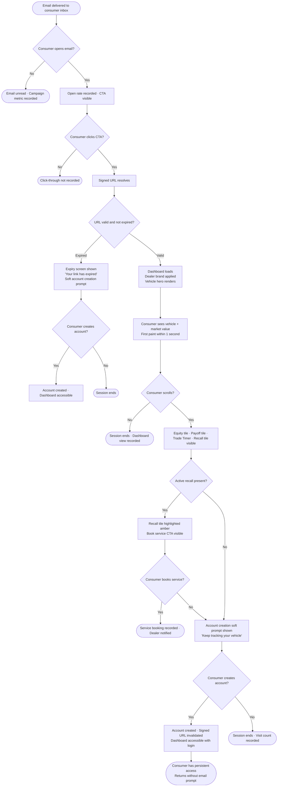
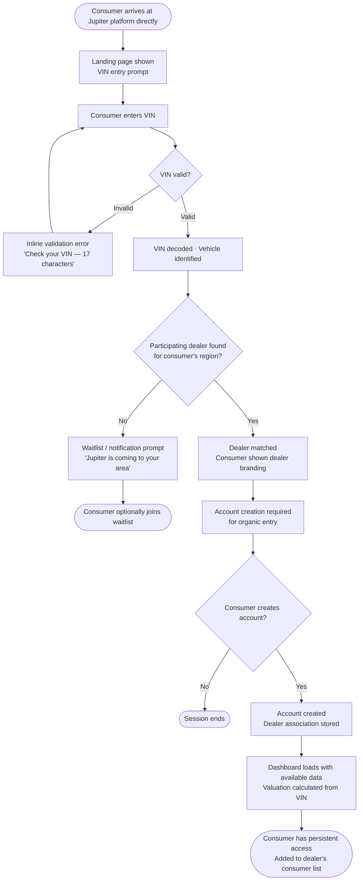
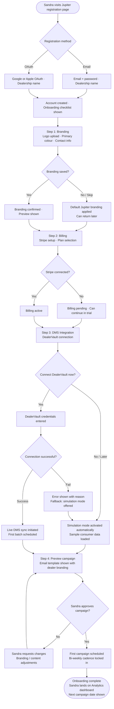
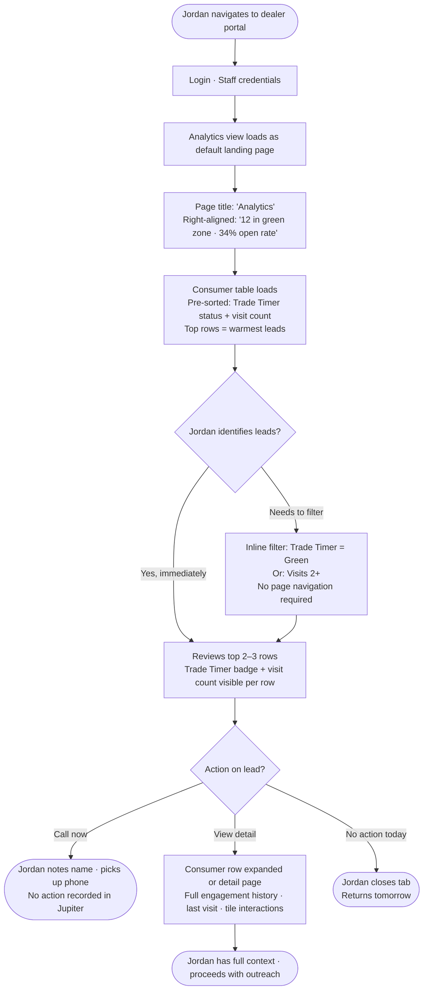
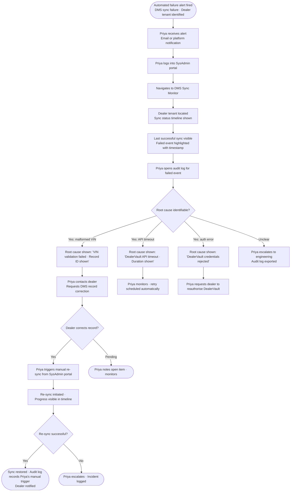

# User Journey Flows

## Journey 1: Consumer — Email-Triggered Cold Entry

Marcus receives a dealer-branded bi-weekly email, taps through, and experiences Jupiter for the first time — no account, no context, no intent.

**Flow optimisations:**
- Dashboard hero renders on first paint — no skeleton loader that looks broken
- No login prompt before any data is shown
- Account CTA appears only after consumer has scrolled past core tiles — earned, not forced
- URL expiry screen is the upgrade funnel, not an error state

---

## Journey 2: Consumer — Direct / Organic Entry

Marcus discovers Jupiter directly and arrives without a dealer-issued signed URL.

**Flow optimisations:**
- VIN entry is the only required field — no form overhead
- Dealer matching is automatic and invisible to the consumer
- Organic entry requires account creation — framed as "set up your vehicle tracker", not "register"

---

## Journey 3: Dealer Admin — Onboarding to First Campaign

Sandra registers, configures her dealership, connects DMS, and activates her first campaign — target: under 30 minutes total.

**Flow optimisations:**
- Each onboarding step is independent — Sandra can skip and return
- Simulation mode activates automatically if DMS is not connected — no dead ends
- Campaign preview is the final confidence-builder before activation
- "First campaign scheduled" is the completion state, not "onboarding complete"

---

## Journey 4: Dealer Staff — Morning Scan

Jordan opens the dealer portal at the start of his day to identify which consumers are worth calling. Target: shortlist visible within 30 seconds.

**Flow optimisations:**
- Analytics is the default post-login view — zero navigation required
- Table is pre-sorted by engagement signal — no filter configuration needed for the standard morning scan
- Inline filtering available for edge cases without leaving the page
- No "save" or "submit" action — scan is passive, action happens off-platform

---

## Journey 5: Jupiter SysAdmin — DMS Failure Diagnosis

Priya receives an automated failure alert and needs to identify root cause, escalate to the dealer, and restore sync — target: root cause found within 2 minutes.

**Flow optimisations:**
- Sync status timeline is the entry point — not a raw log list
- Root cause surfaced at the event level — not buried in log lines
- Manual re-sync is a single action available directly from the dealer tenant view
- Every Priya-initiated action is captured in the audit log automatically

---

## Journey Patterns

**Entry patterns:**
- Consumer always enters via URL (signed or account login) — no app store, no download
- Dealer portal always requires authenticated login — no signed URL access
- SysAdmin portal always requires authenticated login with separate role verification

**Decision patterns:**
- Every optional step (account creation, DMS connection, billing) has a graceful skip path — no dead ends
- Error states always offer a next action — never a dead end screen
- Confirmation steps before irreversible actions (campaign activation, manual re-sync)

**Feedback patterns:**
- Progress is communicated through state changes (badge colour, status label, timeline event) not toast notifications alone
- Success states are calm and understated — no confetti or celebration animations
- Failure states use soft language and always include a next step

## Flow Optimisation Principles

1. **Default state is the useful state** — Every view loads in its most actionable configuration. Jordan's table is pre-sorted. Priya's sync monitor shows the most recent event first. Sandra's onboarding shows the next incomplete step. No configuration required to reach value.
2. **Skip paths everywhere** — Every optional step has a "do this later" path. No flow forces completion of a step that isn't immediately necessary.
3. **Errors are events, not failures** — DMS failures, expired URLs, and invalid VINs are handled as known states with clear next actions. No user should ever see a generic error screen.
4. **Off-ramps, not dead ends** — Every terminal state (URL expired, no dealer found, sync failure) offers a meaningful next step rather than ending the session abruptly.
